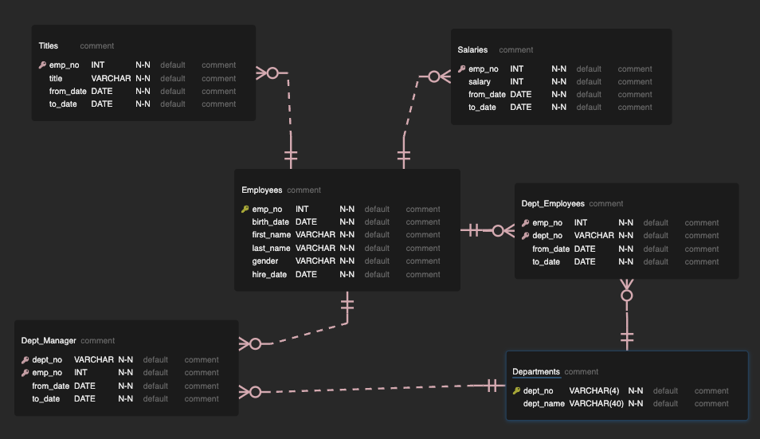

# Employee_Retirement_Analysis

#### Tools Used:

*Postgres SQL 15
*VS Code 1.77
*PGAdmin

## Overview

Of the 72,458 current employees in the company, we looked to determine how many, based on age and hire date, will be retiring soon.  

The analysis highlights the importance of proactively addressing the upcoming changes in the workforce and ensuring a smooth knowledge transfer to maintain organizational effectiveness.

## Results

The first stage of our analysis found that 33,118 employees fall into our retirement eligibility pool.
This drastic change in personal across several departments in the next few years will be a change the company would like to prepare for.

 We first looked at the departments that had the most employees approaching retirement. Then the positions that met those same criteria.

Development - 8,361
Production - 7417
Sales - 5,252

Senior Engineer - 13.651
Senior Staff - 12,872
Management - 2

##### Additional Analysis

With Sales and Development most affected by the upcoming retirement wave, a need for a mentorship program is apparent. 

A table of eligible mentors was created to foster a program that could help train employees in line for advancement to better handle the resposibilities of a potential promotion. 

## Summary

Our analysis revealed that 33,118 employees are approaching retirement based on their age and hire date. This highlights the need for the company to proactively address this workforce change and ensure a smooth transfer of knowledge. Departments such as Development, Production, and Sales will be particularly affected. To prepare for the transition, we recommend implementing a mentorship program that will provide training and support for employees in line for advancement, ensuring a seamless transfer of responsibilities and maintaining the company's success.
